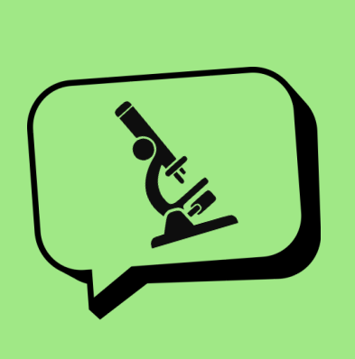

# Science Communication SIG 

Unleash the storyteller in you.

## Schedule

|     Session     |                      Topic                      |  Chair   |
|:---------------:|:-----------------------------------------------:|:--------:|
|  June 29 2023   | Large language models and science communication |  Lieke   |
|   June 1 2023   |                  Writing club                   | Pablo R. |
|   May 4 2023    |                 Talk by Sander                  | Pablo R. |
|  April 6 2023   |                  Writing club                   |  Lieke   |
|  March 9 2023   |                    Cancelled                    |    -     |
| February 9 2023 |                    Kick-off                     | Pablo R. |

## Current lead

- [Pablo R.](https://github.com/PabRod) (p.rodriguez-sanchez@esciencecenter.nl)

## Links

Want to know more about this SIG? Take a look at our [foundational document](./docs/foundation.md).

We also keep a [curated list of materials](./docs/materials.md).
